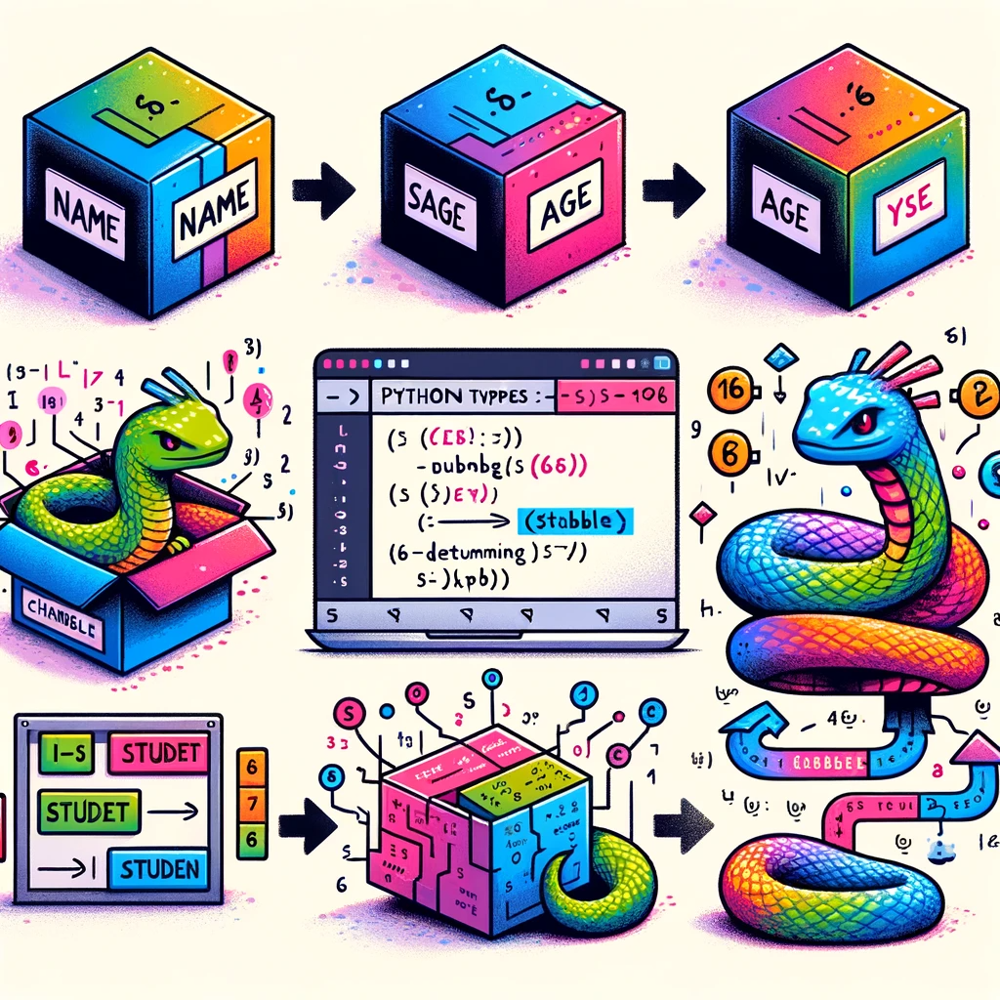

<p align="center">
  
# Что такое переменные

</p>

<p align="center">
    
</p>

**Объявление переменных в Python vs Классические языки**

Представь себе мир, где каждый предмет нужно сначала определить, прежде чем использовать. Если ты хочешь взять ручку, тебе сначала нужно сказать: "Это ручка", и только потом ты можешь её использовать. Так работают классические языки программирования. Когда ты пишешь `string name;`, это как объявить, что "это будет имя", а затем `name = 'Bobby';` — это как назвать ручку "Bobby".

Теперь представь другой мир, где ты просто берешь ручку и говоришь: "Это 'Bobby'". Без объявлений, без формальностей. Это мир Python. Здесь ты пишешь `name = "Bobby"` и всё. Python сам понимает, что это строка. Ты не тратишь время на объявление типов — просто создаешь и используешь.

#### Примеры кода на Python

```python
name = "Bobby"
age = 16
```

Таким образом, в Python `name` автоматически становится строкой с значением `"Bobby"`. А переменная `age` становится `16`.

Здесь age автоматически определяется как целое число 16.

# Как объявляются переменные в классических языках

Сначала объяви переменную, указав её тип. Например: `string name;`. Это означает: `"Здесь будет строка с именем name"`.

```
string name;
```

Только объявление переменной без присваивания значения.

Затем присвой переменной значение: `name = 'Bobby';`. Теперь `name` хранит значение `'Bobby'`.

```
name = 'Bobby';
```

## Python автоматически понимает, что name — это строка

Нет необходимости указывать тип данных. Python автоматически определяет, что `name` — это строка, потому что ты присвоил ей текстовое значение.

В Python всё устроено проще. Ты говоришь: "Это `name`, и онa равнa `'Bobby'`". И Python понимает тебя без лишних деталей.

```python
favorite_food = "Pizza"
favorite_food = "Sushi"
```

Переменная `favorite_food` сначала имеет значение `"Pizza"`, затем мы меняем его на `"Sushi"`. Python легко справляется с такими изменениями.

Таким образом, в Python ты быстрее и проще создаешь переменные, не заботясь о явном объявлении их типов, в отличие от классических языков программирования.

## Вот несколько примеров создания переменных

Некоторые из них (которые непонятны), мы будем разбирать позже

### Пример 1: Строки

```python
first_name = "Alice"
last_name = "Johnson"
greeting = "Hello, " + first_name + " " + last_name + "!"
```

Здесь `first_name` и `last_name` - это строки, и мы создаем еще одну строку `greeting`, соединяя их с приветствием.

### Пример 2: Числа (целые и вещественные)

```python
age = 15
height = 1.75
average_grade = 4.5
```

Переменная `age` - это целое число (`int`), `height` - вещественное число (`float`), а `average_grade` - это тоже `float`, представляющее средний балл.

### Пример 3: Булевы значения

```python
is_student = True
has_library_card = False
is_in_school_team = True
```

Здесь `is_student`, `has_library_card`, и `is_in_school_team` - это булевы переменные (`True`/`False`).

### Пример 4: Списки

```python
favorite_books = ["1984", "Brave New World", "Fahrenheit 451"]
prime_numbers = [2, 3, 5, 7, 11, 13]
temperatures = [20.5, 22.3, 19.8]
```

`favorite_books` - это список строк, `prime_numbers` - список целых чисел, а `temperatures` - список вещественных чисел.

### Пример 5: Словари

```python
student_info = {"name": "Alice", "grade": 9, "age": 15}
book_details = {"title": "1984", "author": "George Orwell", "year": 1949}
color_codes = {"red": "#FF0000", "green": "#00FF00", "blue": "#0000FF"}
```

`student_info`, `book_details`, и `color_codes` - это словари, содержащие пары ключ-значение различных типов данных.

