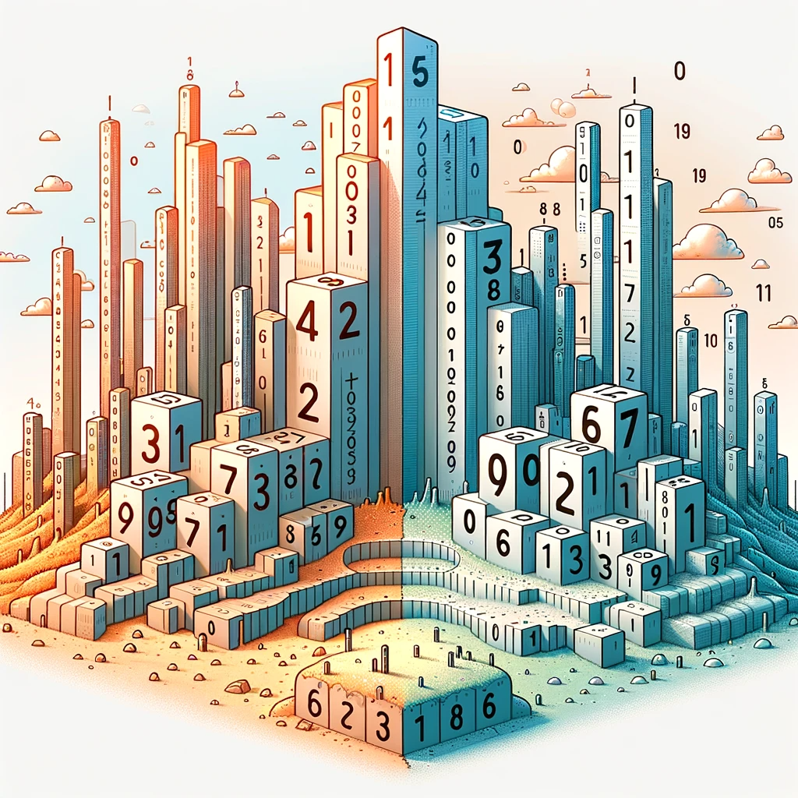

<h1 align="center">О системах счисления</h1>

  

Представь, что числа — это язык, на котором говорят в разных странах Математикии. В одной стране, "Десятичной", используют десять символов (0-9), чтобы выражать любое число, как в слове "десять". Это как алфавит для их чисел.

Но в другой стране, "Двоичной", всего два символа (0 и 1). Это как общение с помощью морзянки, где есть только точки и тире!

В этих странах есть "правила позиций". В "Десятичной" стране, каждая позиция в числе в 10 раз важнее предыдущей справа. Если "2" стоит на месте сотен, это 200. Но в "Двоичной" стране, каждая позиция важнее в 2 раза. Так "10" в двоичной — это на самом деле 2 в десятичной.

## Что же такое система счисления?

Система счисления - это способ представления чисел. Это как алфавит для чисел.

Существуют разные системы. Например, десятичная (0-9) и двоичная (0 и 1).

В позиционных системах каждая позиция в числе имеет свой "вес". В десятичной системе каждая позиция в 10 раз "тяжелее" предыдущей справа. Например, в числе 345, 5 - это единицы, 4 - десятки, а 3 - сотни.

Десятичная система - наша повседневная система. Каждый раз, когда ты считаешь деньги или измеряешь время, ты используешь её.

Двоичная система, используемая в компьютерах, работает только с 0 и 1. Это основа всей цифровой техники.
