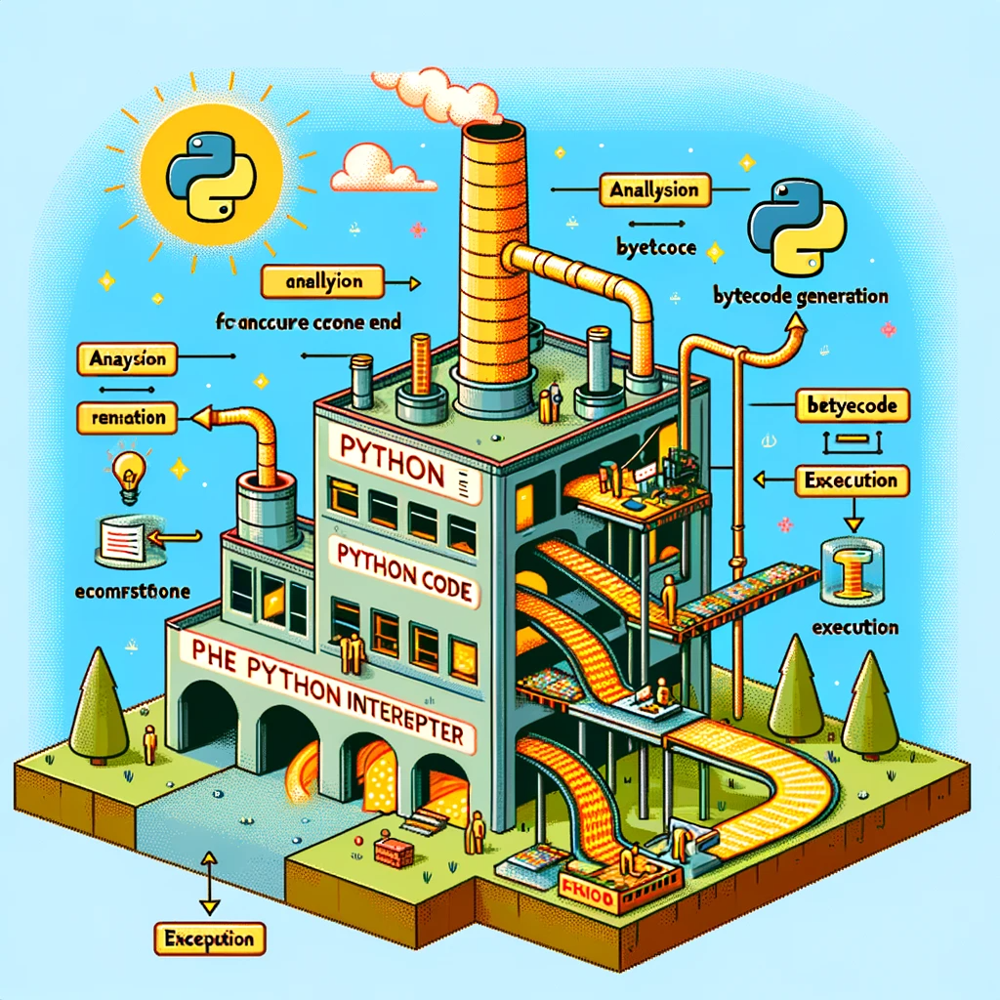

<h1 align="center">Интерпретатор Python</h1>

  

### Повар, который Готовит Блюда по Твоим Рецептам

Представь интерпретатор Python как повара в ресторане. Ты приносишь ему рецепт (твой код), и он сразу же начинает готовить блюдо (выполнять код), не дожидаясь полного списка рецептов. В отличие от повара-компилятора, который сначала собирает все рецепты, переводит их на свой кулинарный язык, и только потом начинает готовку. 

Например, если ты скажешь интерпретатору `"напечатай 'привет'"`, он сразу же это сделает, в то время как компилятор сначала переведет эту инструкцию в машинный код.

# Что такое интерпретатор в Python и как он работает

Интерпретатор - это программа, которая построчно исполняет код, переводя его непосредственно в машинные инструкции.

Отличие от компилятора: компилятор сначала переводит весь код программы в машинный код, и только потом выполняет его. Интерпретатор же работает построчно. Например, `print("Hello, World!")` будет немедленно выполнено интерпретатором.

В Python интерпретация начинается с чтения и анализа кода, затем его преобразования в байт-код и исполнения.

`Байт-код` - это промежуточное представление кода, которое интерпретатор Python преобразует из вашего исходного кода. Например, строка `x = 5` будет преобразована в серию байт-кодов, которые представляют операции присваивания и хранения.

## Как посмотреть байт-код

Это набор бинарных инструкций, который интерпретируется Python-интерпретатором. Он создается из вашего исходного кода и представляет собой промежуточную стадию между вашим высокоуровневым кодом и машинным кодом, который исполняется на вашем компьютере.

Чтобы увидеть байт-код в Python, вы можете использовать модуль `dis`, который дизассемблирует Python функции и показывает представление в виде байт-кода. Например, используя `dis.dis(your_function)`, где `your_function` - это функция, определенная вами, вы можете увидеть байт-код, соответствующий этой функции.

# Установка Python на Windows и Mac:

- Перейдите на официальный сайт Python: **python.org**.
- Скачайте установщик Python для вашей операционной системы (Windows или Mac).
- Запустите установщик и следуйте инструкциям на экране.
- Для Windows убедитесь, что отметили опцию **"Add Python to PATH"**.
- Для Mac просто следуйте шагам установщика.
- После установки откройте командную строку (Windows) или терминал (Mac) и введите `python` или `python3`, чтобы убедиться, что установка прошла успешно.
